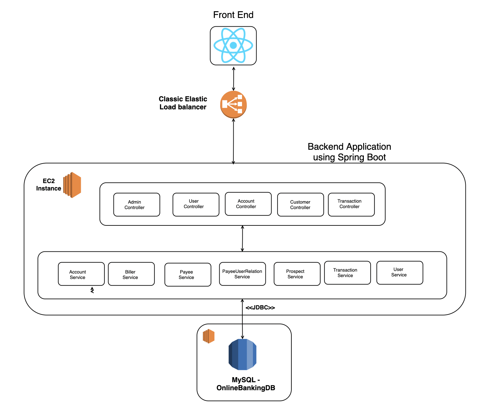

## Team Members

- Vamsi Srinivas Chalamolu
- Kevin Hsu
- Shreshta Balmuri
- Tejas Desai

## Online Banking features:

### User:

* Registration for normal user online banking account.

* Each normal user will have 2 accounts, Checking, Savings accounts.

* Transfer (internal) between your own accounts - one time or recurring

* Set up recurring or one-time Bill payment for external payees

* View and search Transactions - for credits/debits/checks/fees - up to  last 18 months

### Admin:

* Adding new accounts - Checking, Savings

* Closing existing accounts

* Add transactions - such as manual refunds on fees

## Tools and Languages

* FrontEnd using React

* Backend using springboot

* Database using Mysql

* Scrum Management using Jira

## Architecture Diagram

## XP Core Values Implemented:

- **Communication**

* Communication played huge role in our team. We had scrum calls twice a week, where we discussed the 
progress of each team member, thereby making necessary decisions and further roadmap.

- **Feedback**

* Each one of the team members gave feedback to one another in the team, during the testing phase, which 
greatly helped us in identifying the bugs. Code has been committed to master after proper review and 
feedback from the team.

- **Respect**

* Throughout the project, each one of us had valued and considered others ideas and suggestions and respected each others availability and timeline. 

## Individual Contribution

- Our team work division has two categories, Frontend and Backend application development

- Frontend Application design, implementation - Kevin , Vamsi.

- Backend Application design, implementation   - Vamsi and Shreshta.

- Deployment - Tejas

## Screenshots

